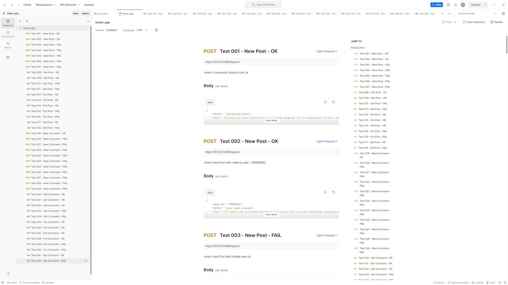

# Simple REST API in Django REST framework

Simple REST API to interact with Post and Comment data the Fake API in JSONPlaceholder (Free Fake REST API) using Python 3, Django, Django REST framework and PostgreSQL.

## 🚀 Installation

In this section we will guide how to create a Django REST framework environment used in this project in 6 steps:

1. Install a virtual environment, you must have python pre-installed in your system.
```python
python3.8 -m virtualenv venv
```
2. Now open a directory and starts the project in a virtual environment. For this, run the following command in that directory.
```python
venv\Scripts\Activate.ps1
```
3. Open your activated virtual environment and install Django using the following command.
```python
pip install Django==4.1.4
```
4. Now that we have installed Django Web framework and anothers lib that used in this project.
```python
pip install djangorestframework==3.14.0
# Django-filter is a generic to allows users to filter down a queryset based on a model’s fields.
pip install django-filter==22.1
# Requests is a simple HTTP library. Used to connect with the JSONPlaceholder.  
pip install requests
# Psycopg2 is a  driver for interacting with PostgreSQL from the Python. 
psycopg2-binary==2.9.6
```
For more details about the requirements this project, see too the [requirements.txt](https://github.com/ThoberDetofeno/stroer/blob/main/source_code/stroer_prj/requirements.txt)

5. After the installation, start a Django project using the command:
```python
django-admin startproject stroer_prj
```
6. Next, start an app.
```python
python manage.py startapp stroer_app
```
You just created your Django app for this project.

At this point we have a complete skeleton project. 
Now we should first run a database migration. 
```python
# Running database migrations
python manage.py makemigrations
python manage.py migrate
```
We'll also create an initial user. 
```python
python manage.py createsuperuser
```
In the last, run the development web server by calling the runserver command.
```python
python manage.py runserver
```
## :hammer: Commands
In this project has 3 Django commands to help in the beginning and synchronize the systems.

1. Import all Post and Comments linked with JsonPlaceHolder.
```python
python manage.py import_jsonplaceholder
```
2. Delete all Post and Comments linked with JsonPlaceHolder.
```python
python manage.py delete_jsonplaceholder
```
3. Synchronizes the MASTER systems with the JSONPlaceholder API.
   
Synchronization with Option "forced". Delete all Posts and Comments and re-include.
```python
python manage.py sync_jsonplaceholder -p forced
```
Synchronization with Option "add". It includes all the Posts and Comments that are in JsonPlaceHolder but not in MASTER.
```python
python manage.py sync_jsonplaceholder -p add
```
Synchronization with Option "check". This option includes new posts and comments made after the last import.
```python
python manage.py sync_jsonplaceholder -p check
```
## 🏃‍♂️ REST APIs
This REST API provides an interface for applications to interact with Post and Comment.
### POST API
#### Schema
The schema defines all the fields that exist within a post record.
| Field  | Description |
| ------------- | ------------- |
| id  | Unique identifier for the post.  |
| user_id  | The ID for the author of the post. |
| title  | The title for the post.  |
| body  | The content for the post.  |

#### List Posts

#### Create a Post

#### Update a Post
Arguments: [id, title, body]

Definition: PUT /post/id/

Example Request: PUT https://example.com/post/1/
```JSON
{
    "title": "new title",
    "body": "new body"
}
```
or partial update
```JSON
{
    "title": "New Title"
}
```

#### Delete a Post
Arguments: [id]

Definition: DELETE /post/id/

Example Request: DELETE https://example.com/post/1/

### COMMENT API
#### Schema
The schema defines all the fields that exist within a comment record.
| Field  | Description |
| ------------- | ------------- |
| id  | Unique identifier for the comment. |
| post_id  | The ID of the associated post object.  |
| name  | Display name for the comment author. |
| email  | Email address for the comment author.  |
| body  | The content for the comment.  |

#### List Comments
Query this endpoint to retrieve a collection of comments. The response you receive can be controlled and filtered using the URL query parameters below.

Definitions: GET /comment/ | GET /comment/id/ | GET /comment/?post_id=value

Example Request: 
* GET all comments: https://example.com/comment/
* Get a comment: GET https://example.com/comment/1/
* Get all comments of a Post: https://example.com/comment/?post_id=1

#### Create a Comment
Arguments: [post_id, name, email, body]

Definition: POST /comment/

Example Request: POST https://example.com/comment/
```JSON
{
   "post_id": 1,
   "name": "et fugit eligendi deleniti quidem qui sint nihil autem",
   "email": "Presley.Mueller@myrl.com",
   "body": "doloribus at sed quis culpa deserunt consectetur qui praesentium"
}
```
#### Update a Comment
Arguments: [id, post_id, name, email, body]

Definition: PUT /comment/id/

Example Request: PUT https://example.com/comment/1/
```JSON
{
   "post_id": 1,
   "name": "new name",
   "email": "new.email@myrl.com",
   "body": "newbody"
}
```
or partial update
```JSON
{
   "name": "new name"
}
```
#### Delete a Comment
Arguments: [id]

Definition: DELETE /comment/id/

Example Request: DELETE https://example.com/comment/1/

## :bomb: REST API Tests
API tests were created and executed using Postman. We created 42 API tests for most common CRUD operations.

 
The created tests can be imported into Postman from the file below:

[stroer_app.postman_collection.json](https://github.com/ThoberDetofeno/stroer/blob/main/test/stroer_app.postman_collection.json)

See also <a href="https://learning.postman.com/docs/getting-started/importing-and-exporting-data/">Importing and exporting data</a>.

## :whale: Docker and docker-compose
